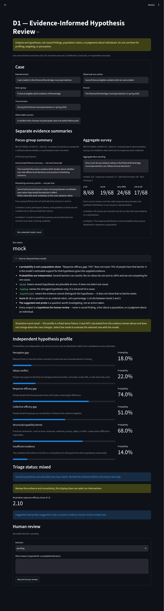

# D1 — European Election Abstention Diagnostic Prototype


> **Group Action Barrier Mapper** is an open-source research and facilitation toolkit for exploring why a group may not take an intended action. D1 is a local Streamlit prototype that turns bounded, anonymized evidence into several testable hypotheses for human review. It does **not** identify causes, profile people, or make decisions about individuals.

## At a glance

| Area | What this prototype provides |
| --- | --- |
| Interface | A local Streamlit application for reviewing one prepared case at a time |
| Cases | A fictional synthetic demonstration and one manually curated European election abstention case |
| Modes | An offline `mock` mode and an explicitly selected `live` mode using an OpenRouter model through a prompt-based System One Adapter bridge |
| Output | Six independent hypothesis probabilities, a local triage status, an optional Score, and a suggested next diagnostic probe |
| Human role | A facilitator reviews the evidence and can record a pending, confirmed, corrected, or rejected decision |
| Storage | In-memory Streamlit session state only; there is no database or account system |
| Safety boundary | Outputs are hypotheses for investigation, not causal findings, population estimates, or judgments about individuals |

## Application preview



*The screenshot shows the fictional Riverbridge case in offline mock mode. Its profile is a fixed demonstration fixture, not a calculation from the evidence shown.*

## What problem does D1 help explore?

When a group does not take an intended action, the same visible behavior can have very different explanations. People may misunderstand the relevant facts, disagree about priorities, doubt that an action will work, be unable to coordinate, or face a practical constraint such as missing authority or limited time.

D1 keeps these possibilities separate instead of forcing them into one definitive label. In live mode, it sends typed decision prompts through a System One Adapter bridge to the explicitly selected OpenRouter model, then applies a small, inspectable local policy to describe the level of uncertainty. This is not Liquid AI's native D1 Decision Model.

The six hypotheses are:

| Hypothesis | Plain-language question |
| --- | --- |
| **Perception gap** | Are relevant facts, scale, visibility, or action-to-outcome relationships misunderstood or missing? |
| **Values conflict** | Could people share the relevant facts but disagree about priorities, principles, trade-offs, or who bears the costs? |
| **Response-efficacy gap** | Do people doubt that the proposed action will produce a meaningful result? |
| **Collective-efficacy gap** | Do people doubt that the group can coordinate or influence the result together? |
| **Structural/capability barrier** | Do time, resources, authority, access, safety, or skills make action difficult or impossible? |
| **Insufficient evidence** | Is the available record too thin or contradictory to distinguish the other hypotheses responsibly? |

These hypotheses can coexist. Their probabilities are independent and are not expected to add up to 100%.

## Quick start: run the offline demo

The default mock mode is the safest way to explore the interface. It does not require an API key or a network connection.

From the repository root:

```sh
python -m venv .venv
source .venv/bin/activate
pip install -r requirements.txt
python -m streamlit run app.py
```

Run Streamlit with the virtual environment's Python (`python -m streamlit run app.py` while the venv is active, or directly `.venv/bin/python -m streamlit run app.py`). A globally installed Streamlit may use a different interpreter without the project dependencies, so use the project venv for live mode.

Streamlit will print a local URL, normally `http://localhost:8501`. Open it in a browser and follow this path:

1. Choose a **Case** in the sidebar.
2. Leave **Run mode** set to `mock` for an offline demonstration.
3. Review the evidence shown in the form. Synthetic fields can be edited; curated fields are read-only.
4. Select **Run selected mode: mock**.
5. Read the independent hypothesis profile and the triage explanation.
6. If useful, record a human review decision and a short reason.

### Important: mock output is fixed

The mock profile is a deterministic illustrative fixture. It is useful for demonstrating the UI and running tests, but it is **not calculated from the evidence currently shown on screen**. Editing the synthetic case does not change the mock profile. Select live mode only when you deliberately want to send the selected structured case to the explicitly selected OpenRouter model.

## The two bundled cases

### Synthetic demonstration

The synthetic case is fictional and exists to make the workflow easy to test without exposing real people or sensitive records. Its action, observed non-action, and selected evidence fields can be edited in the interface. It should not be interpreted as a real study or as evidence about a population.

### Curated real evidence

The curated case is a bounded, manually prepared example about abstention in the 2009 European Parliament election. It keeps two evidence streams separate:

- A 2009 post-electoral survey with reported aggregate reasons for non-voting.
- Themes from 2012 abstention focus groups, which are exploratory and not representative of the whole population.

The record preserves the source methods, dates, provenance, and limitations. The survey values are rounded multi-select percentages for a non-voter base reported as 57% of the total sample; up to three answers were allowed, so the percentages do not need to sum to 100%. The source facts retained in this project do not provide a respondent count for that base, and no count is invented.

The application uses the structured record in `data/curated_cases.json`. It does not parse or upload the local PDFs, archive bundles, transcripts, recordings, or respondent-level data. See [`data/README.md`](data/README.md) for provenance and reuse notes.

## How a run works

Each run follows the same bounded flow:

1. **Load a prepared case.** The app validates the action, observed non-action, evidence IDs, and supported evidence fields.
2. **Choose a mode explicitly.** Mock mode uses the local fixture; live mode sends typed decision prompts through the System One Adapter bridge to OpenRouter.
3. **Evaluate independent questions.** The live request contains the selected structured case and bounded questions for the six hypotheses. It does not ask the model to produce an open-ended causal explanation.
4. **Normalize the response.** The application keeps only known, finite values and rejects malformed or unexpected results.
5. **Apply local triage.** The deterministic policy labels the profile as `leading`, `mixed`, `possible`, `insufficient`, `unsupported`, or `unavailable`.
6. **Review with a human.** A facilitator can leave the result pending or record a decision with a short reason. This review is held only in the current Streamlit session.

A live failure remains an error. The application never silently substitutes a mock result for a failed live request.

## Interpreting the results

### Hypothesis probabilities

A value such as `Response-efficacy gap: 74%` means that the selected model returned 0.74 support for that bounded hypothesis given the supplied case. It does **not** mean that 74% of people have that barrier, that the barrier caused the behavior, or that an intervention will work.

Several values can be high at the same time. A high structural-barrier score can coexist with a high response-efficacy score, for example. The profile is a map of possibilities to investigate, not a competition to select one winner.

### Triage status

The local policy uses illustrative low and high cutoffs of `0.35` and `0.65`. These values have not been validated against a representative labeled evaluation set.

| Status | Meaning |
| --- | --- |
| `leading` | One barrier hypothesis reaches the illustrative high cutoff. It is not established as the cause. |
| `mixed` | At least two barrier hypotheses reach the high cutoff; they may be interacting or require separate investigation. |
| `possible` | One or more barrier hypotheses reach the low cutoff, but none reaches the high cutoff. |
| `insufficient` | Evidence is unusable or the insufficient-evidence hypothesis reaches the high cutoff. Gather more evidence before distinguishing barriers. |
| `unsupported` | No barrier hypothesis reaches the low cutoff. This does not prove that no barrier exists. |
| `unavailable` | A valid result could not be produced or safely normalized. |

Every status still requires human review. In particular, `leading` is not a causal conclusion and `unsupported` is not evidence of absence.

### Optional Score and Choice outputs

Live and mock results may also include two other bounded decision primitives:

- **Score:** an illustrative 0–3 position describing how strongly the evidence indicates a response-efficacy doubt. It is an ordered score, not a percentage.
- **Choice:** a suggested next diagnostic probe, such as checking factual understanding, mapping values and trade-offs, auditing practical constraints, or collecting more evidence. It is a suggestion for investigation; the app does not take an action automatically.

## Optional live mode

Live mode is an explicit opt-in and requires both `OPENROUTER_API_KEY` and `OPENROUTER_MODEL`. The model must be selected explicitly; D1 has no default and does not read `D1_MODEL` or use `d1:free`.

```sh
export OPENROUTER_API_KEY='your-key'
# Replace this placeholder with the exact model identifier you selected on OpenRouter:
export OPENROUTER_MODEL='provider/model-name'
python -m streamlit run app.py
```

The adapter uses `system-one-adapter[openai]` with `OpenAIProvider` and OpenRouter's Chat Completions API root, `https://openrouter.ai/api/v1`. Noul, Score, and Choice question objects are sent through the adapter as prompts; this is a prompt-based System One bridge, not Liquid AI's native D1 Decision Model and not an equivalence claim. A live provider call has not been verified end to end; the normal test suite uses offline fakes and fixtures.

OpenRouter routes requests to model providers. Data retention and training use depend on OpenRouter's current settings and the selected model/provider. In particular, do not assume that Liquid models listed on OpenRouter inherit the retention or training terms of Liquid AI's native D1 Decision Model; check the current applicable terms before sending data. Use synthetic data unless the selected route's handling is acceptable.

For a local ignored `.env` file, set `OPENROUTER_API_KEY` and `OPENROUTER_MODEL` there; D1 does not load `.env` automatically. Manually load the file into the process environment using the shell example below.

### Troubleshooting live mode

Failures stay visible as errors; the app never substitutes a mock result. Open **Diagnostic details (safe)** on the error panel to see bounded structural information (field and type names only — never response values, payloads, or credentials).

| Message | What it means | What to do |
| --- | --- | --- |
| `OPENROUTER_API_KEY` is required for live requests. / `OPENROUTER_MODEL` is required for live requests. | Live mode requires both variables; there is no implicit model fallback. | Set the API key and an exact OpenRouter model identifier in the process environment. `D1_MODEL` is ignored. |
| `The System One OpenAI adapter is unavailable for live mode.` | The required adapter or question SDK dependency is unavailable to this Python interpreter. | Install `requirements.txt` in the project venv and start with `.venv/bin/python -m streamlit run app.py`. |
| `The live request failed; no mock result was substituted.` | The provider call raised an exception (for example a timeout). The diagnostic shows the exception class name only. | Retry only after checking provider status and configuration; the diagnostic does not expose a request or response payload. |
| `The live response could not be safely normalized.` | The OpenRouter model response did not match the adapter's expected `answers` contract. | The diagnostic shows the failing path (for example `answers.values_conflict`) and received key/type structure only; share it without payload values. |

You can keep the variables in an ignored local `.env` file, but the application does not load `.env` automatically. Load it into the process environment before starting Streamlit, for example in a POSIX shell:

```sh
set -a
. ./.env
set +a
python -m streamlit run app.py
```

Never commit credentials. Do not add API keys, access tokens, raw transcripts, respondent-level rows, or other confidential material to the repository or to a live request.

## Privacy and responsible use

D1 is deliberately narrow. Before using live mode:

- Use anonymized summaries rather than names, email addresses, employee IDs, or direct identifiers.
- Do not submit raw transcripts, recordings, private messages, respondent-level survey rows, or confidential case files.
- Do not use the output for individual psychological, political, vulnerability, employment, eligibility, or persuasion profiles.
- Keep focus-group themes and survey aggregates separate; they answer different methodological questions.
- Preserve missing, dissenting, and contradictory evidence instead of removing it to make the profile look clearer.
- Treat a missing signal as uncertainty, not as proof that a barrier is absent.

The local privacy checks are bounded safeguards, not a complete anonymization or redaction system. Human review remains necessary before any research decision or intervention. Before live use, verify current OpenRouter and selected model-provider retention/training terms. For Liquid models offered through OpenRouter, do not infer that Liquid AI's native D1 data terms apply; keep requests synthetic unless the selected route's current handling is acceptable.

## Repository layout

```text
.
├── README.md
├── D1.md                         # Design plan and research questions
├── app.py                        # Streamlit UI and user flow
├── requirements.txt
├── Portada horizontal 169 proyecto open source.png
├── screencapture-localhost-8501-2026-10-02-10_39_05.png  # Synthetic mock-mode application preview
├── src/
│   ├── app_state.py              # Fixture loading, run orchestration, review state
│   ├── case_schema.py             # Case and evidence validation
│   ├── liquid_client.py            # Optional OpenRouter System One Adapter bridge
│   ├── privacy.py                  # Bounded live-request privacy checks
│   ├── response_normalizer.py      # Provider response normalization
│   └── triage_policy.py            # Deterministic status policy
├── data/
│   ├── synthetic_cases.json
│   ├── curated_cases.json
│   └── README.md                  # Source provenance and limitations
└── tests/
    ├── test_app_state.py
    ├── test_case_schema.py
    ├── test_liquid_client.py
    ├── test_privacy.py
    ├── test_response_normalizer.py
    ├── test_triage_policy.py
    └── fixtures/system_one_response.json
```

## Tests

Run the offline suite from the repository root:

```sh
.venv/bin/python -m pytest -q
```

The tests cover case validation, app-state orchestration, triage rules, privacy checks, response normalization, and the OpenRouter adapter boundary through fakes and saved fixtures. They do not require a network connection and do not prove that a real live API/model configuration works.

## Current scope and limitations

This repository is a working local prototype rather than a production service. It intentionally does not provide:

- causal inference or validated predictive accuracy;
- respondent-level data analysis or raw-document ingestion;
- automated messaging, targeting, persuasion, or intervention selection;
- persistent storage, user accounts, audit history, or multi-tenant isolation;
- a general-purpose case upload or data-management workflow;
- a guarantee that the optional live SDK/model configuration is available or compatible.

A responsible next step after a hypothesis profile is to gather better evidence, test the relevant distinction with a facilitator, and measure what happened after any separately approved intervention. A single model response cannot establish why a group acted or failed to act.

## Related documentation

- [`D1.md`](D1.md) — design plan, taxonomy, input contract, and research questions.
- [`data/README.md`](data/README.md) — source provenance, archive boundaries, and reuse limitations.
- [`app.py`](app.py) — the Streamlit interface and visible user workflow.
